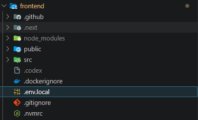

# GamerIN Frontend

**기획 및 테스트**
- 서장호

**프론트엔드**
- 전준범 (팀장)
- 김신의

**백엔드**
- 방경식
- 이상혁


## 프론트엔드 셋업

### 1. 다음 버전이 설치되어 있어야 함

- Node.js 22.22.1 LTS
- npm 10 이상

Node 버전 확인:
```bash
node -v
npm -v
```
### 2. 프로젝트 루트에서 아래 명령어 실행
```bash
cd frontend
npm install
```
설치된 패키지 버전 확인
```bash
cd frontend
npm list
```
### 3. 개발 서버 실행
```bash
cd frontend
npm run dev
```

### 3. application-local.yaml 설정
**backend/src/main/resources/application-local.example.yaml** 을 참고하여 같은 디렉토리에 application-local.yaml 생성.
그 후 본인이 설정한 패스워드 입력

### 4. .env.local 생성 
프론트엔드 프로젝트 폴더에 .env.local 파일 생성 후 NEXT_PUBLIC_API_BASE_URL=http://localhost:8080 적어두고 저장.

- docker 세팅으로 인해서 로컬 개발 서버 실행시 해당 부분이 꼭 필요함. 

### 4. 수정 일지

- **26/04/22** 서장호  
  
  > AuthContext에 `isAuthReady`와 옵션형 `logout()`을 추가하여 인증 초기화 및 로그아웃 흐름 정리  
  > 로그아웃 시 `/login`으로 즉시 이동하도록 수정하고 `/home` 및 하위 경로에 로그인 가드 적용  
  > 로그인 페이지에서 이미 로그인된 사용자는 `/home`으로 리다이렉트되도록 수정  
  > 비밀번호 재설정 성공 시에는 로그아웃만 수행하고 성공 화면은 유지하도록 예외 처리  
  > `ErrorToast`, `MentorDetailModal`, `Mentoring`, `PostDetail` 등에 명시적 타입을 적용해 기존 ESLint 에러 제거  
  > 문자열 이스케이프 처리 및 미사용 import 정리를 통해 남아 있던 코드 품질 이슈 보완  
  > 주요 이미지 컴포넌트를 `next/image`로 전환하고 `next.config.ts`에 Unsplash 원격 이미지 허용 설정 추가  
  > `useSearchParams()`를 사용하는 `/auth/reset-password`, `/find-id-result` 페이지에 `Suspense` 경계 추가  
  > `Header`, `Sidebar`의 로그아웃 핸들러 타입 충돌 및 `AddAcountModal` import 경로 오류 수정  
  > `npm run lint`, `npm run build` 검증 완료 및 경고/빌드 오류 없이 통과 확인  

  > 요약 : 로그아웃했을때 홈화면에 남아있는 현상 수정 + lint와 build 했을때 나오는 오류 경고들 모두 수정  

- **26/05/14** 서장호  
  
  > `auth-store`에 `AUTH_USER_KEY`, `AUTH_CLEARED_EVENT`, `clearStoredAuth()`를 추가하여 인증 상태 정리 로직 통합  
  > refresh token 검증 실패 시 `gamerin_access_token`뿐 아니라 `gamerin_user`도 함께 삭제하도록 수정  
  > 인증 상태가 정리되면 전역 이벤트를 발생시켜 `AuthContext`의 `user` 상태도 즉시 `null`로 동기화  
  > 앱 부팅 시 저장된 `gamerin_user`를 바로 로그인 상태로 처리하지 않고 `refreshAccessToken()`으로 서버 세션 유효성 먼저 검증  
  > refresh 실패 또는 저장된 유저 정보 파싱 실패 시 저장된 인증 정보를 정리하고 `/home` 진입 대신 `/login`으로 이동되도록 처리  
  > `login`, `updateUser`, `logout`에서 `gamerin_user` 문자열 직접 사용을 제거하고 공통 인증 저장소 상수를 사용하도록 수정  
  > 백엔드에 아직 없는 `/api/v1/feed/trending/games` 호출을 홈 피드 초기 로딩에서 비활성화하여 피드 API 정상 응답까지 실패 처리되는 문제 방지  

  > 요약 : 서버/DB 재시작 후 브라우저에 남은 이전 로그인 정보로 홈에 진입하거나 피드에서 401 인증 오류가 반복되는 문제 수정  

- **26/05/30** 서장호  

  > Docker 운영 배포를 위한 프론트엔드 Dockerfile과 .dockerignore 추가  
  > Node 22 기반 멀티 스테이지 빌드로 의존성 설치, Next.js 빌드, production 실행 이미지를 분리  
  > Docker 빌드 시 `NEXT_PUBLIC_API_BASE_URL`을 build arg로 주입하도록 구성  
  > reverse proxy 환경에서 `NEXT_PUBLIC_API_BASE_URL`을 비워 `/api/...` 상대경로 호출이 가능하도록 구성  
  > production 컨테이너에서 `npm run start`로 Next.js 앱을 3000 포트에서 실행하도록 구성  

  > 요약 : 프론트엔드 Docker 이미지 빌드 및 reverse proxy 배포에 필요한 코드/설정 추가  

- **26/05/31** 서장호  

  > 게시글 상세 화면 진입 시 기존 댓글 목록을 불러올 수 있도록 `fetchPostComments()` API 함수 추가  
  > `PostDetail`에서 게시글 상세 정보와 댓글 목록을 함께 요청하도록 변경  
  > 기존 화면에서 새로 작성한 댓글만 보관하던 `submittedComments` 상태를 실제 댓글 목록 상태로 통합  
  > 댓글이 없을 때 표시되는 안내 문구를 기존 API 미지원 문구에서 일반 빈 상태 문구로 변경  
  > 게시글 카드와 상세 화면의 점 3개 버튼을 메뉴로 동작하도록 변경  
  > 작성자 본인 게시물(`mine`)일 때만 삭제 항목이 표시되도록 처리  
  > 삭제 요청 시 `DELETE /api/v1/posts/{postId}` API를 호출하는 `deletePost()` 함수 추가  
  > 삭제 성공 후 피드, 상세, 북마크, 프로필 게시글 목록에서 해당 게시물이 즉시 제거되도록 상태 갱신 연결  

  > 요약 : 게시글 상세 화면에서 기존 댓글 목록과 새로 작성한 댓글이 함께 표시되도록 프론트 연동 수정  

- **26/06/03** 서장호  

  > 북마크 데이터를 프론트 localStorage가 아닌 백엔드 `post_bookmarks` API 기준으로 사용하도록 변경  
  > `/home/friends` 북마크 화면을 제거하고 `/home/bookmarks` 서버 연동 북마크 화면으로 라우트 변경  
  > Sidebar의 북마크 메뉴 경로를 `/home/bookmarks`로 수정  
  > `fetchMyBookmarks()`를 사용해 내 북마크 목록을 커서 기반으로 불러오고 `더 보기` 버튼으로 다음 페이지를 조회하도록 구현  
  > 기존 `bookmark-store.ts`와 북마크 localStorage 이벤트 의존성을 제거하여 서버 데이터를 단일 기준으로 정리  
  > 피드, 프로필, 북마크 목록에서 북마크 저장/해제 상태가 부모 목록 상태에도 즉시 반영되도록 연결  
  > 북마크 화면에서 북마크 해제 성공 시 해당 게시글이 목록에서 즉시 제거되도록 처리  
  > 게시글 카드의 빈 영역 클릭 시 상세 화면으로 이동하도록 카드 클릭 영역을 확장  
  > 좋아요, 북마크, 공유, 메뉴, 프로필 영역은 카드 상세 이동에서 제외되도록 클릭 이벤트 분리  
  > 댓글 버튼을 정상 버튼으로 복구하고 클릭 시 게시글 상세 화면의 댓글 작성/목록 영역으로 이동하도록 처리  
  > 북마크 페이지의 게시글 카드에도 좋아요/좋아요 취소 핸들러를 연결하여 좋아요 버튼이 정상 동작하도록 수정  
  > 북마크 페이지 좋아요 처리 시 optimistic update를 적용하고 API 실패 시 기존 상태로 롤백되도록 처리   

  > 요약 : 북마크 화면을 백엔드 API 기반으로 전환하고 게시글 카드의 상세 이동, 댓글, 좋아요 버튼 동작을 수정  

- **26/06/04** 서장호  

  > 멘토 미등록 사용자의 상태 확인을 `GET /api/v1/mentoring/mentors/{userId}` 실패 응답이 아닌 `GET /api/v1/mentoring/mentors/me` 정상 응답 기준으로 변경  
  > `fetchMyMentorProfile()`을 추가하고 `loadCurrentMentorProfile()`에서 사용하여, 멘토 등록 전 사용자는 `data: null` 상태로 멘토 등록 UI를 표시하도록 정리  
  > 신청 목록의 리뷰 완료 여부를 프론트 임시 상태나 `fetchMentorReviews()` 재조회 결과로 추론하지 않고, 백엔드가 내려주는 `application.reviewed` 필드 기준으로 표시하도록 변경  
  > 리뷰 작성 성공 또는 중복 리뷰 방어 처리 시 해당 신청 항목의 `reviewed` 값을 로컬 상태에서도 즉시 `true`로 갱신하도록 보강  
  > `MentoringApplicationResponse` 타입에 `reviewed`를 추가하고, 백엔드 응답 계약에 맞춰 `mentorId`, `menteeId`, `programTitle` 사용 흐름을 정리  
  > 실제 백엔드에 없는 신청 삭제 API 호출 함수 `deleteMentoringApplication()`을 제거하고, 취소된 신청은 `CANCELLED` 상태 배지만 표시하도록 UI 정리  
  > 404 응답 메시지 처리에서 `message`가 없을 수 있는 타입 오류를 방지하도록 `MentoringApiError` 생성 로직 보완  

- **26/06/06** 서장호

  > Docker/nginx 배포 환경에서 메시지 API가 `localhost:8080`으로 직접 호출되어 `ERR_CONNECTION_REFUSED`가 발생하던 문제 수정  
  > `src/lib/api-base.ts`에서 `NEXT_PUBLIC_API_BASE_URL`이 비어 있을 때 브라우저의 `window.location.origin`을 API base로 사용하도록 변경  
  > 운영 배포에서는 `/api/...` 요청이 현재 접속 origin의 nginx를 거쳐 backend로 프록시되도록 정리  
  > 설정값에 trailing slash가 포함되어도 중복 slash가 생기지 않도록 `NEXT_PUBLIC_API_BASE_URL` 끝의 `/`를 제거하는 처리 추가  
  > 메시지 페이지와 멘토링 페이지의 채팅 시작 기능이 같은 메시지 API base URL을 사용하도록 흐름 정리  
  > 메시지 SSE 연결은 nginx에서 `/api/v1/messages/stream` 전용 설정을 추가해 buffering을 끄고 timeout을 늘리는 방식으로 보완  
  > 배포 후 backend/frontend 컨테이너 IP 변경으로 nginx upstream이 stale 상태가 되는 문제를 줄이기 위해 deploy 스크립트에 nginx reload 추가  
  > 검증: `npm run lint`, `npm run build` 통과, 배포 후 `/home/messages` 200 응답 및 메시지 API 401 인증 응답 확인  

  > 요약 : 메시지 API가 `localhost:8080`으로 직접 호출되던 문제를 수정하고, nginx reverse proxy 기준으로 메시지/SSE 연결이 동작하도록 정리  

- **26/06/06** 서장호

  > 백엔드에서 메시지 수정 API를 지원하지 않도록 정리한 계약에 맞춰 메시지 수정 버튼과 편집 입력 UI 제거
  > `src/lib/message-api.ts`에서 `updateConversationMessage()`와 `message-updated` 실시간 이벤트 타입 제거
  > `src/lib/message-store.ts`와 메시지 응답 변환 흐름에서 `editedAt` 필드 제거
  > 메시지 말풍선 액션 메뉴는 삭제만 제공하도록 단순화하고, 삭제/대화방 나가기 상태 처리에서 편집 상태 의존성 제거
  > 검증: `npm run lint`, `npm run build` 통과

  > 요약 : 메시지 수정 기능 제거에 맞춰 프론트 메시지 API 계약과 UI를 삭제 전용 흐름으로 정리

- **26/06/10** 서장호

  > 인증 후 공통 레이아웃을 `src/app/(app)/layout.tsx` route group layout으로 분리하고 기존 `AppShell` 컴포넌트 제거
  > `/messages`, `/bookmarks`, `/mentoring`, `/settings`, `/profile`, `/profile/[userId]`, `/posts/[postId]` 페이지를 최상위 라우트 구조로 이동
  > `/home/messages`, `/home/bookmarks`, `/home/mentoring`, `/home/profile`, `/home/settings` 구 라우터와 호환 redirect 제거
  > `/home` 피드 라우트는 현재 URL을 유지하면서 같은 `(app)` 레이아웃을 사용하도록 정리
  > 메시지 페이지 직접 진입 시 최상위 대화방이 자동 선택되어 읽음 처리되던 동작 제거
  > `/messages`는 대화 미선택 상태로 유지하고, 대화 카드 클릭 또는 `conversationId`/`recipient` 쿼리 기반 명시 진입만 대화방을 열도록 정리
  > 대화 목록 갱신, SSE 갱신, 대화방 나가기 이후에도 첫 대화방으로 자동 이동하지 않도록 선택 상태 초기화
  > 새 메시지 송수신 시 최신 메시지 기준으로 메시지 목록 최하단으로 자동 스크롤되도록 보완
  > 검증: `git diff --check origin/main...HEAD`, `npm run lint`, `npm run build` 통과

  > 요약 : 인증 후 화면 라우팅을 최상위 경로 기준으로 정리하고, 메시지 화면에서 원치 않는 자동 읽음 처리를 방지

- **26/06/11** 서장호

  > 메시지 페이지 진입 시 팔로잉 목록을 미리 불러오던 `fetchFollowing()` 호출을 제거하여 `/api/v1/users/{handle}/following` 401 오류가 메시지 화면 오류로 노출되던 문제 수정
  > 새 대화 검색 컴포넌트에서 `allowedRecipientHandles` 기반 프론트 필터링과 로딩 상태 의존성을 제거
  > 새 대화 시작 및 `/messages?recipient=...` 진입 시 프론트에서 팔로우 여부를 검사하던 차단 로직 제거
  > 프로필 메시지 버튼의 `isFollowing` 기반 비활성화와 "팔로우한 사용자에게만 메시지를 보낼 수 있습니다." 안내 문구 제거
  > 팔로우 여부는 프로필 팔로우 버튼과 팔로우 목록 상태에만 사용하고, 메시지 상대 검색 정책은 백엔드 `messages/recipients` API에서 적용할 수 있도록 역할 분리
  > 검증: `git diff --check`, `npm run lint`, `npm run build` 통과

  > 요약 : 메시지 화면 재진입 시 팔로잉 API 401 오류가 뜨던 원인을 제거하고, 프론트의 메시지 상대 팔로우 제한 정책을 정리

- **26/06/11** 서장호

  > main 브랜치 `feature/routing-profile-message-refactor` 브랜치에 병합
  > `src/app/(app)/layout.tsx`에 main 브랜치의 소셜 로그인 후 무한 리다이렉트 방지 로직을 반영하고, 인증 준비 전/비로그인 상태에서 보호 화면이 렌더링되지 않도록 가드 유지
  > `src/app/(app)/home/page.tsx`는 PR 브랜치의 `/posts/[postId]` 상세 라우팅 구조를 유지하도록 충돌 해결
  > main 브랜치의 `/home?postId=...` 기반 홈 내부 `PostDetail` 렌더링 방식은 새 최상위 게시글 상세 라우팅 구조와 중복되어 제거
  > 병합 과정에서 홈 피드 JSX의 불필요한 fragment와 들여쓰기 정리

  > 요약 : PR #27 자동 병합을 막던 홈/레이아웃 충돌을 해소하고, 최상위 라우팅 구조와 소셜 로그인 안정화 로직을 함께 유지

- **26/06/15** 서장호

  > 백엔드 `PATCH /api/v1/users/me`가 성공 시 프로필 객체가 아닌 `data: null`을 반환하는 계약에 맞춰 `updateMyProfile()` 흐름 수정
  > 프로필 수정 성공 후 `GET /api/v1/users/me`를 다시 호출해 최신 프로필을 화면과 인증 사용자 상태에 반영하도록 변경
  > `UserProfile` 타입에 백엔드 응답 필드인 `location`, `website`, `coverImageUrl`을 추가
  > 편집 모달의 `location`, `website` 초기값을 서버 프로필 값으로 채우고, 저장 시 `nickname`, `bio`, `location`, `website`를 백엔드 프로필 수정 API로 전송하도록 연결
  > 프로필 커버/아바타 파일은 브라우저 canvas에서 JPEG로 압축한 뒤 `POST /api/v1/users/me/profile-images` 업로드 API로 전송하고, 이미지 URL은 업로드 API가 서버 프로필에 직접 반영하도록 변경
  > API 성공 전에 커버/아바타 localStorage 상태를 먼저 바꾸던 흐름을 제거하고, 저장 성공 후 서버 응답 기준으로 커버/아바타 상태를 동기화
  > data URL 이미지로 인한 브라우저 storage quota 초과를 방지하기 위해 프로필 커버/아바타 legacy localStorage 저장을 제거하고, 인증 사용자 캐시에서도 이미지 필드를 제외
  > 프로필 화면에 위치와 웹사이트 표시를 추가하고, 다른 사용자 프로필에서도 서버 `coverImageUrl`을 사용하도록 수정
  > 백엔드 validation에 맞춰 닉네임 2~20자, 소개글 160자 이하, 위치 100자 이하, 웹사이트 2048자 이하 및 URL 형식 검증 추가
  > 이미지가 변경되지 않은 저장에서는 기존 이미지 URL을 다시 보내지 않아 legacy data URL 값이 PATCH payload로 흘러가지 않도록 처리
  > 게시물 이미지/동영상 썸네일 선택을 백엔드 업로드 계약에 맞춰 JPEG/PNG, 장당 20MB 이하로 제한하고 영상 선택 MIME/확장자도 MP4/MOV/M4V로 정리
  > 검증: `git diff --check`, `npm run lint`, `npm run build` 통과

  > 요약 : 프로필 수정 화면을 백엔드 프로필 수정/이미지 업로드 API 계약에 맞춰 연결하고, 위치/웹사이트/커버/아바타 상태가 서버 프로필 기준으로 반영되도록 정리

- **26/06/15** 서장호

  > 인증 사용자 캐시에 `profileImageUrl`을 유지하도록 정규화 흐름을 보완
  > 프로필 페이지 진입 및 프로필 수정 성공 후 최신 서버 프로필 이미지 URL을 인증 사용자 상태에 반영하도록 변경
  > 상단바, 좌측 사이드바 하단, 게시글 작성창에서 기본 이니셜 대신 서버 프로필 이미지를 우선 표시하도록 수정
  > 메시지 수신자 타입과 메시지 화면 대화 목록, 새 대화 검색 결과, 대화 헤더, 상대방 말풍선 아바타에 `profileImageUrl` 표시를 연결
  > 이미지 URL이 없거나 로딩에 실패한 경우 기존 이니셜 fallback을 유지하도록 처리
  > 검증: `git diff --check`, `npm run lint`, `npx tsc --noEmit`, `npm run build` 통과

  > 요약 : 프로필 이미지 변경 후 홈 피드 외 상단바, 사이드바, 작성창, 메시지 화면에도 최신 프로필 사진이 반영되도록 정리
