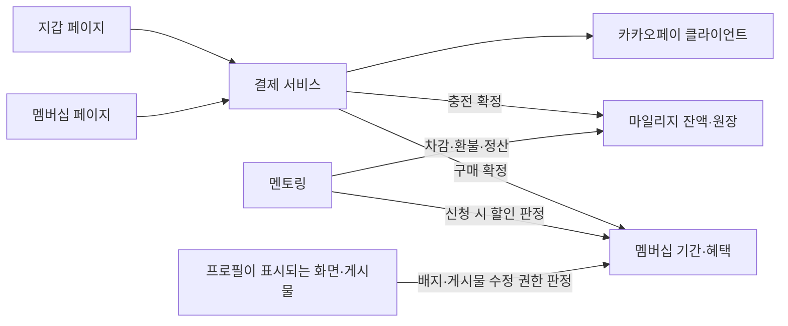

# 카카오페이 설계 — 모듈 분리·페이지 구성 (3~4절)

[← 카카오페이 설계 문서 목차](README.md)

## 3. 모듈 분리

**확정:** 현재 백엔드의 서버·빌드 구조를 유지하고 `domain/payment`와 `domain/membership` 패키지로 책임을 나눈다. `KakaoPayClient`는 `domain/payment/client`에 둔다. 멤버십 혜택 판정이나 멘토링 정산에서 카카오페이 API를 직접 호출하지 않는다.

### 3-1. 확정한 분리 방향과 세부 책임

| 모듈 | 담당 | 다른 모듈에 맡길 일 |
|---|---|---|
| `domain/payment` | 결제 주문, 금액·구매자 검증, 승인·취소·조회, 멱등성, 미확정 결제 복구 | 멤버십 혜택 판정, 멘토링 수수료 계산 |
| `domain/payment/client/KakaoPayClient` 및 전용 DTO | 카카오페이 단건 결제 HTTP 요청·응답 | 잔액·게시물·프로필 직접 변경 |
| `domain/membership` | 이용 기간, 구매·환불 정책, 혜택 판정, 구매에 연결된 기간 부여 | 카카오페이 HTTP 호출, 멘토링 정산 실행 |
| 기존 `domain/user`의 마일리지 코드 | 잔액·원장·적립·차감 | 결제 성공 추측, 회원 등급 관리 |
| `domain/mentoring` | 신청·에스크로·정산, 신청 당시 수수료율 보존 | 결제사 API 호출 |
| `domain/post`, `domain/user` | 수정 권한 집행, 사용자 프로필이 표시되는 모든 응답에 배지 표현 | 별도 구독 상태 사본 관리 |

확정한 결제 방식에 따라 `PaymentService`가 결제 목적별로 마일리지 적립 또는 멤버십 기간 부여를 호출하도록 설계한다. `MembershipService`는 카카오페이에 의존하지 않고 현재 혜택을 제공한다.

**확정:** 별도 서버·저장소·Gradle 멀티모듈은 도입하지 않는다. 범용 PG 프레임워크나 카카오페이 하나를 위한 인터페이스·팩토리도 현재 필요하지 않다. 마일리지 파일 전체를 새 도메인으로 옮기는 작업은 결제 도입의 선행 조건이 아니다.

멘토링의 기존 `PaymentStatus`는 에스크로 상태다. 새 외부 결제 상태와 같은 enum으로 합치지 않는다.

### 3-2. 프론트 API 경계

- `src/lib/payment-api.ts` 신설: 결제 준비·승인·상태 조회.
- `src/lib/membership-api.ts` 신설: 이용권·혜택 조회와 구매 관련 요청.
- `src/lib/mileage-api.ts` 유지: 잔액·거래 내역. `chargeMileage`는 결제 전환 시 제거.
- 기존 `api-client.ts`의 인증·오류 처리를 재사용한다. Secret key는 프론트에 전달하지 않는다.

## 4. 페이지는 멘토링 밖으로 분리

**확정:** `/membership`에서 이용권·혜택을, `/wallet`에서 잔액·충전·내역을 관리한다. 기존 멘토링의 충전·전체 거래 내역 UI는 지갑으로 이동하고 멘토링에는 잔액 요약·충전 바로가기·수수료 할인 안내를 남긴다.

### 4-1. 선택지 비교

| 선택지 | 장점 | 한계 | 판단 |
|---|---|---|---|
| 멘토링 안에 모두 유지 | 현재 수정량이 작음 | 게시물 수정·배지를 원하는 일반 사용자도 멘토링으로 진입해야 함 | 멘토 전용 할인권일 때 적합 |
| 멤버십·지갑 독립, 멘토링에 바로가기 | 혜택 구매와 잔액 관리 목적이 명확하고 멘토링 흐름도 연결 가능 | 메뉴·페이지 이동 정리 필요 | **사용자 선택** |
| 설정 안에서만 제공 | 메뉴가 간결함 | 혜택 발견·가입 접근성이 낮음 | 관리 진입점으로 보조 사용 |

### 4-2. 확정한 페이지와 화면

아래 경로와 진입점은 확정이다. 각 화면 안의 세부 배치는 구현 중 조정할 수 있다.

| 경로 | 사용자에게 보이는 이름 | 주요 내용 |
|---|---|---|
| `/membership` | GamerIN 멤버십 | 혜택·가격 비교, 30일 이용권 구매, 현재 이용 기간·만료일, 직접 재구매 |
| `/wallet` | 내 지갑 | 잔액, 충전 패키지(`GET /api/v1/payments/products`), 마일리지 거래 내역(기존 API), 결제 내역(`GET /api/v1/payments`) |
| `/payments/result` | 결제 결과 | 카카오페이 approval/cancel/fail 복귀 지점. PC 팝업에서는 결과를 부모 창에 전달하고 닫히며, 모바일·부모 창 부재 시에는 인증 복구 → 서버 승인·상태 확인 → 충전/멤버십 결과와 돌아가기 (6-4절). 인증 복구 실패 시 승인하지 않고 로그인 안내(6-3절) |
| `/mentoring` | 멘토링 | 프로그램·신청·수강·정산, 잔액 요약·충전 링크·할인 안내 |
| 기존 `/settings` | 설정 | 멤버십 관리·내 지갑 링크 |

지갑에서 마일리지 원장과 현금 결제 내역은 구분한다. 10,000원 결제와 10,000 마일리지 적립이 두 번 지출한 것처럼 보이지 않게 한다. 같은 페이지의 탭으로 묶으면 충분하다.

- **데스크톱:** 사이드바에 멤버십 진입점, 계정 영역·프로필 메뉴에 지갑 진입점을 둔다.
- **모바일:** 기존 5개 하단 탭을 유지하고 프로필·계정 메뉴에서 접근한다. 현재 공유 `menuItems`에 두 항목을 단순 추가하면 `grid-cols-5`와 맞지 않는다.
- **문맥별 진입:** 멘토 정산 할인 안내와 내 게시물 수정 혜택 안내에서도 `/membership`으로 연결한다.
- **잔액 부족:** 멘토링 신청 → 지갑 충전 → 원래 프로그램으로 복귀 → 사용자가 신청 확정. 충전 성공만으로 신청을 자동 제출하지 않는다.
- 현재 프로그램 상세는 컴포넌트 상태 중심이므로 프로그램 ID를 이용한 복귀·딥링크 지원이 필요하다. 돌아갈 목적지는 허용된 내부 경로로 제한한다.

비가입자에게는 혜택·가격·30일 이용 기간·자동 갱신 없음을, 가입자에게는 상태·만료일·재구매 안내를 먼저 보여준다. 결제 중 중복 버튼을 막고, 결과 불명은 `결제 확인 중`으로 표시한다. 결과 제목으로 포커스를 이동하고 `aria-live`로 상태를 알린다. 충전 패키지는 키보드로 선택 가능하게 한다.
