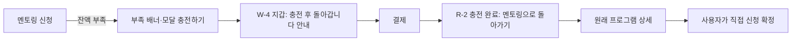
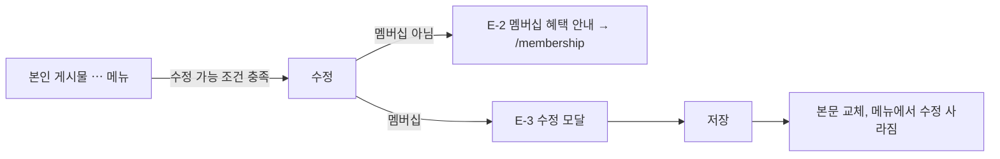

# 카카오페이 설계 — 프론트 인계서: 디자인 → 선행 개발 → 머지 (13절)

[← 카카오페이 설계 문서 목차](README.md)

## 13. 프론트 인계서

작성일: 2026-10-10 · 코드 확인 기준: frontend `feature/kakaopay` `019fcf4`, backend `feature/kakaopay` `062b51d`

이 문서 하나만 읽고 디자인부터 프론트 머지까지 진행할 수 있도록 정리했다. 정책 근거는 [README](README.md), 구현 세부(코드 조각·파일 위치)는 [08 문서](08-frontend-design-dev.md)를 따른다. **08 문서와 다르게 적힌 부분은 이 문서가 우선한다**(13-9절에 차이를 모았다).

### 13-0. 한 줄 요약과 진행 전제

- 만드는 것: **내 지갑(카카오페이 충전)**, **멤버십(30일 이용권 구매)**, **결제 결과 페이지**, **멤버십 배지**, **게시물 1회 수정**, **멘토 수수료 표시**.
- 프론트는 백엔드 완료를 기다리지 않는다. 2026-10-10 기준 백엔드 작업 브랜치(#85~#92)에는 아직 커밋이 없다. API 계약은 기존 문서에서 확정됐으므로 **API가 이미 있다고 가정하고 확정 계약대로 바로 구현**해 100% 완성한 뒤 머지한다. 개발용 mock 모드는 두지 않는다(13-7-2). 남은 2건(게시물 수정 응답 형태, 수수료 필드 이름)은 백엔드 구현에 맞춘다(13-7-1).
- 진행 순서: ① 디자인(13-1~13-6) → ② 계약 확인(13-7-1) → ③ 계약대로 구현(13-7-2~3) → ④ 테스트·머지(13-8).

### 13-1. 사용자가 알아야 할 숫자와 규칙 (화면에 그대로 나옴)

| 항목 | 값 | 화면에서 주의할 점 |
|---|---|---|
| 충전 패키지 | 5,000 / 10,000 / 30,000 / 50,000원 | 1원 = 1 M, 보너스 없음. 자유 금액 입력 없음 |
| 멤버십 | 30일 이용권 4,900원 | 자동 갱신 없음, 직접 재구매. 기간 중에도 미리 구매하면 기존 만료일에 30일 추가 |
| 멤버십 혜택 | ① 닉네임 옆 왕관 배지 ② 게시물 1회 수정 ③ 멘토 정산 수수료 10% → 5% | 멘티 결제 금액은 바뀌지 않음. 카카오페이 수수료와 무관 |
| 게시물 수정 | 게시 후 1시간 이내, 게시물당 1회, 본문만 | 이미지·영상은 수정 불가. `수정됨` 표시 없음 |
| 결제 수단 표기 | `CARD` → 카드, `MONEY` → 카카오페이머니 | |
| 금액 단위 | 현금 `4,900원`, 마일리지 `5,000 M` | 같은 돈이 두 번 쓰인 것처럼 보이지 않게 **반드시 구분** |

제외(그리지 않음): 환불·결제 취소 버튼, 자동 갱신, 관리자 화면 배지, 수정 이력, 자유 금액 입력.

### 13-2. 사용자 흐름

#### 충전 (PC: 팝업 / 모바일: 페이지 이동)

```mermaid
flowchart TD
  A[내 지갑에서 패키지 선택] --> B[카카오페이로 결제 클릭]
  B -->|PC| C{팝업 열림?}
  C -->|차단| C1[P-2 팝업 차단 안내]
  C -->|열림| D[P-1 결제 진행 모달 + 카카오페이 팝업]
  D -->|팝업에서 결제 완료| E[R-1 결제 확인 중 → R-2 충전 완료]
  D -->|팝업을 그냥 닫음| F[P-3 결제가 취소되었습니다]
  D -->|결제 중단 버튼| F
  B -->|모바일| G[카카오페이 화면으로 이동]
  G --> H[/payments/result 로 복귀] --> E
  E -->|응답 지연·불명| I[R-4 결제 결과를 확인하고 있어요]
  I -->|확정| E
  I -->|2분 경과| J[R-5 결제 내역에서 확인]
```

#### 멤버십 구매

충전과 같은 결제 흐름이다. 시작점이 `/membership`이고 완료 화면이 R-3(만료일 안내)이며, 완료 후 헤더·사이드바의 배지가 바로 나타난다.

#### 잔액 부족 → 충전 → 멘토링 복귀



충전 성공만으로 신청을 자동 제출하지 않는다.

#### 게시물 수정



### 13-3. 화면 목록 (디자인 프레임 단위)

각 프레임은 **라이트/다크 × 모바일(375)/데스크톱(1280)** 4종을 만든다. ID는 Figma 프레임 이름과 PR·이슈 설명에 그대로 사용한다.

| ID | 화면·상태 | 위치 |
|---|---|---|
| **공통** | | |
| C-1 | 멤버십 배지(왕관) 단독 + 닉네임 결합 + 긴 닉네임 말줄임 | 모든 닉네임 옆 |
| C-2 | 결제 상태 배지 3종: `완료`·`취소됨`·`확인 중` | 결제 내역 |
| **내 지갑 `/wallet`** | | |
| W-1 | 기본: 잔액 카드 + 패키지 미선택(결제 버튼 비활성) | |
| W-2 | 패키지 선택됨: 버튼 `카카오페이로 10,000원 결제` | |
| W-3 | 결제 준비 중: 버튼 `결제 준비 중…` 비활성 | |
| W-4 | `returnTo` 안내 배너: `충전 후 멘토링 신청으로 돌아갑니다` | 상단 |
| W-5 | 마일리지 내역 탭: 목록·빈 상태·로딩·오류·페이지 이동 | 기존 `MileageTransactionPanel` 이동 |
| W-6 | 결제 내역 탭: 목록(날짜·상품명·금액·상태 배지·결제 수단)·빈 상태·`더 보기`·로딩·오류 | |
| W-7 | 상품 목록 로딩 스켈레톤 / 불러오기 실패(`다시 시도`) | 충전 영역 |
| **결제 진행 (PC 부모 창)** | | |
| P-1 | 결제 진행 모달: 안내 + `결제 창 다시 열기` + `결제 중단` | 오버레이 |
| P-2 | 팝업 차단 오류 카드 | 결제 버튼 아래 |
| P-3 | 팝업 종료·중단 후 `결제가 취소되었습니다` | 토스트 |
| P-4 | 결제 준비 실패(503·네트워크): `결제 서비스를 잠시 사용할 수 없어요…` | 결제 버튼 아래 카드 |
| **결제 결과 `/payments/result`** (앱 셸 없음, 가운데 카드 1장) | | |
| R-0 | 팝업 모드 전달 중: `결제 결과를 전달하고 있어요` (보통 즉시 닫힘) | 팝업 480×720 |
| R-1 | 승인 중: 스피너, 버튼 없음 | |
| R-2 | 충전 완료: `10,000 M이 충전되었어요` + `지갑으로` (+`returnTo` 있으면 `멘토링으로 돌아가기`) | |
| R-3 | 멤버십 완료: `멤버십이 2026-12-09까지 이용 가능해요` + `멤버십 보기` | |
| R-4 | 결제 확인 중(자동 재조회): `결제 결과를 확인하고 있어요` + `결제 내역 보기`. **새 결제 버튼 없음** | |
| R-5 | 확인 중 2분 경과: `결제 내역에서 결과를 확인할 수 있어요` + `결제 내역 보기` | |
| R-6 | 결제 안 됨(실패·만료·사용자 취소): `결제가 완료되지 않았어요` + `다시 결제하기` | |
| R-7 | 로그인 필요: `로그인 후 결제 내역에서 결과를 확인해주세요` + `로그인` | |
| R-8 | 잘못된 접근(주문 없음·타인 주문·`orderId` 누락): `결제 정보를 찾을 수 없어요` + `홈으로` | 08 문서에 없던 상태 |
| **멤버십 `/membership`** | | |
| M-1 | 비가입: 가격·30일·자동 갱신 없음·혜택 3종·`카카오페이로 4,900원 결제` | |
| M-2 | 이용 중: `👑 이용 중`, 만료일, `지금 재구매하면 → 예상 만료일`, `30일 연장하기 4,900원` | |
| M-3 | 만료됨(이전 이용 이력 있음): `2026-11-09에 만료되었어요` + 다시 구매 | 08 문서에 없던 상태 |
| M-4 | 로딩 스켈레톤 / 불러오기 실패 | |
| M-5 | 409 오류: `이전 결제 취소를 처리하고 있습니다. 잠시 후 다시 시도해주세요` | 결제 버튼 아래 |
| **게시물 수정** | | |
| E-1 | 본인 게시물 ⋯ 메뉴에 `수정` 항목(신고·삭제와 같은 줄 스타일) | 피드·상세 |
| E-2 | 비가입자 확인창: `게시물 수정은 멤버십 혜택이에요` → `멤버십 보기`/`취소` | 기존 `useConfirm` |
| E-3 | 수정 모달: 남은 시간·textarea·글자 수 `812/1000`·안내문·`취소`/`수정하기` | |
| E-4 | 본문 변경 없음: `수정하기` 비활성 | |
| E-5 | 시간 만료: 남은 시간 0 → 버튼 비활성, `수정 가능 시간이 지났어요` | |
| E-6 | 저장 중: `수정하는 중…` | |
| E-7 | 서버 거부(시간·횟수·숨김·검열 실패): 서버 메시지를 모달 안 오류 영역에 표시 | |
| **멘토링 변경** | | |
| MT-1 | `내 마일리지` 카드: 잔액 + `충전하기` + `전체 내역` (기존 테스트 충전 폼 삭제) | 내 멘토링 탭 |
| MT-2 | 잔액 부족 배너·모달의 `충전하기` | 기존 위치 |
| MT-3 | 멘토 요청 카드 수수료 줄: `10,000 M 중 수수료 500 M(5%) · 수령 9,500 M` | 받은 멘토링 요청 |
| MT-4 | 비가입 멘토 안내: `멤버십이면 수수료 5%` + `/membership` 링크 | MT-3 아래 |
| **진입점** | | |
| N-1 | 데스크톱 사이드바: 메뉴 아래 `멤버십`(Crown) 링크, 사용자 카드에 `내 지갑`(Wallet) + 잔액 | 모바일 하단 탭 5개는 **변경 없음** |
| N-2 | 모바일 본인 프로필: 설정 버튼 옆 `멤버십`·`내 지갑` 아이콘 버튼 | |
| N-3 | 설정 `계정` 섹션: `내 신고`와 같은 링크 카드로 `멤버십`, `내 지갑` | |

### 13-4. 컴포넌트 명세

| 컴포넌트 | 규격 | 상태 |
|---|---|---|
| `MembershipBadge` | lucide `Crown` 14px, 닉네임 바로 뒤 `gap-1`, `shrink-0`(닉네임만 말줄임). 라이트 `amber-600`, 다크 `#f5b93d`. 툴팁·접근성 이름 `멤버십 회원` | 단일 상태 |
| 충전 패키지 선택 | radio 카드 4개, 모바일 1열·데스크톱 2열. 각 카드: `10,000원` 크게, `→ 10,000 M` 보조. 하단 고정 문구 `1원당 1마일리지 적립 · 보너스 없음` | 기본·hover·선택·포커스 링·비활성(결제 진행 중) |
| 결제 버튼 | `rounded-xl h-12`, 라이트 `bg-black text-white`, 다크 `bg-[#f5b93d] text-black`. 문구에 금액 포함 | 비활성·기본·로딩 |
| 결제 진행 모달 | 기존 모달 톤(카드 `rounded-2xl`). 버튼 2개 | 기본만. Esc = 결제 중단 |
| 결제 상태 배지 | pill. `완료` 중립(검정/흰), `취소됨` 회색, `확인 중` amber 계열 | 3종 |
| 결과 카드 | 아이콘(성공·확인 중·실패·잠금) + 제목 + 보조문 + 버튼 1~2개 | R-1~R-8 |
| 게시물 수정 모달 | 상단 제목 + `남은 시간 42분`, textarea, 글자 수, 안내 2줄, 버튼 2개 | E-3~E-7 |

### 13-5. 디자인 토큰 (현재 코드에서 가져옴, 새로 만들지 않음)

| 용도 | 값 |
|---|---|
| 배경 | 라이트 `#ffffff`, 다크 `#09090b` |
| 카드 | `rounded-2xl border border-zinc-100 bg-white p-5` |
| 섹션 라벨 | `text-xs font-black uppercase tracking-[0.18em] text-zinc-400` |
| 제목 | `text-2xl font-black`, 큰 금액 `text-3xl font-black` |
| 주요 버튼 | 라이트 검정, 다크 `#f5b93d` + 검정 글자 (멘토링 탭·사이드바와 동일) |
| 멤버십 강조 | 라이트 `amber-600`, 다크 `#f5b93d` (`#f5b93d`는 흰 배경 대비 부족 → 라이트 금지) |
| 아이콘 | lucide (`Crown`, `Wallet`, `CreditCard`, `CheckCircle2`, `Loader2`, `AlertCircle`) |
| 하단 여백 | 모바일 하단 탭 높이 `--tab-bar-height`만큼 |
| 브레이크포인트 | 모바일 1열, `lg` 이상 2열 |

카카오페이 로고·노란색(#FFEB00) 버튼은 쓰지 않는다. 카카오페이 브랜드 사용 가이드 확인 전까지 버튼 문구 `카카오페이로 결제`만 쓴다.

### 13-6. 문구 총괄

13-3절 표의 문구가 기준이다. 아래는 표에 넣기 어려운 보조 문구다.

| 위치 | 문구 |
|---|---|
| 잔액 카드 보조 | `멘토링 신청·환불·정산에 사용됩니다.` |
| P-1 본문 | `카카오페이 창에서 결제를 완료해주세요.` / `QR 또는 카카오톡 알림으로 결제할 수 있어요.` |
| P-2 | `팝업이 차단되었습니다. 브라우저 주소창의 팝업 차단을 해제한 뒤 다시 시도해주세요.` |
| M-1 하단 | `멘티 결제 금액은 바뀌지 않습니다.` / `GamerIN 정산 수수료 할인이며 카카오페이 수수료와 무관합니다.` |
| M-2 | `기간이 남아 있어도 구매하면 만료일에 30일이 더해져요.` |
| E-3 안내 | `이미지·영상은 수정할 수 없어요. 게시물당 1회만 수정됩니다.` |
| W-6 빈 상태 | `결제 내역이 없습니다` |
| 403 | `권한이 없는 주문입니다` |
| 404 | `주문을 찾을 수 없습니다` |

### 13-7. 프론트 선행 개발 방식

#### 13-7-1. API 계약: 확정분은 그대로, 남은 2건은 백엔드에 맞춤

API 계약은 기존 문서에서 확정됐다. 프론트는 계약을 새로 정하거나 바꾸지 않고 아래 확정 계약과 [08 문서 12-8절](08-frontend-design-dev.md) 타입을 그대로 사용한다.

| 확정 항목 | 근거 |
|---|---|
| 경로·용도, 요청 본문(`{ productCode, requestId }`, `{ orderId, pgToken }`), 상태 9개, 오류 HTTP, 재호출 응답 | 04 문서 6-1·6-6절 |
| ready 응답 `pcUrl`·`mobileUrl`(TID 없음) | 04 문서 6-4절 |
| 결제 목록 필드(TID·AID·CID·URL 제외) | 04 문서 6-6절 |
| 배지 `membershipBadge`·`authorMembershipBadge` | 06 문서 B1 |
| 게시물 수정 정보 `editableUntil`·`editCount` | 06 문서 E8 |
| 내 멤버십 `active`·`expiresAt`·가격·기간 | 06 문서 M7 |

DTO 필드 이름은 구현 중 조정될 수 있다(04 문서 6-1절). 그래서 응답 키는 도메인 API 모듈의 정규화 함수 한 곳에서만 읽고, 화면은 08 문서 12-8절 타입만 쓴다. 백엔드 PR이 머지되면 이 함수만 실제 DTO와 대조해 고친다.

**남은 2건은 백엔드 구현에 맞춘다(프론트가 정하지 않음).**

| 항목 | 백엔드 확정 전 프론트 처리 | 백엔드 PR 머지 시 |
|---|---|---|
| `PATCH /api/v1/posts/{postId}` 응답 형태(#92) | 응답 본문을 쓰지 않는다. 성공하면 보낸 본문과 `editCount = 1`로 목록·상세를 갱신한다 | 백엔드 응답 형태를 확인하고, 게시물을 반환하면 그 값으로 갱신할지 정한다 |
| 멘토링 수수료 응답 필드 이름(#91) | 08 문서의 `feeRateBp`·`feeAmount`로 가정하고 정규화 함수에서만 읽는다. 예상 수령액은 `applied − floor(applied × bp / 10000)`로 화면에서 계산한다 | 실제 DTO 이름으로 정규화 함수를 고친다 |

계약이 아닌 프론트 구현 선택: 충전 완료 적립액은 1원 = 1 M 정책에 따라 결제 `amount`로 표시하고, 멤버십 완료 만료일은 결과 페이지가 `GET /api/v1/memberships/me`를 다시 불러 표시한다. 만료됨(M-3)은 `active = false`이고 `expiresAt`이 과거인 경우다.

#### 13-7-2. 개발용 mock 없이 계약대로 구현

API가 이미 있다고 가정하고 13-7-1절 계약의 경로·요청·응답 그대로 호출한다.

- 운영 코드에 mock 분기·가짜 결제창·mock 플래그를 두지 않는다. API 함수는 `apiRequest()`로 계약 경로를 바로 호출한다.
- 백엔드 머지 전에는 개발 서버에서 결제·멤버십 호출이 실패한다(404 등). 이때 화면이 오류 상태(W-7, M-4, P-4 등)로 보이는 것은 정상이다.
- 화면 상태 검증은 기존 테스트 방식 안에서만 응답을 대체해서 한다. Vitest는 `vi.mock`, Playwright는 `page.route`를 쓴다. 기존 `e2e/` 테스트 6개가 모두 이 방식이다.

#### 13-7-3. 구현 순서 (모두 즉시 시작 가능)

| 순서 | 작업 | 화면 ID |
|---|---|---|
| 1 | `payment-api.ts`·`membership-api.ts` 타입·함수, `payment-device.ts`, `returnTo` 검증 유틸 | — |
| 2 | `MembershipBadge` + 각 API 정규화에 배지 기본값 false + 08 문서 12-9절 위치에 삽입 | C-1 |
| 3 | `/wallet` (패키지·잔액·마일리지 내역 이동·결제 내역 탭) | W-1~W-7, C-2 |
| 4 | 결제 진행(PC 팝업·모바일 이동), `/payments/result`, `AuthContext` 팝업 refresh 예외 | P-1~P-4, R-0~R-8 |
| 5 | 결과 불명 재조회(3·5·10초, 이후 15초, 최대 2분, 숨김 탭 정지) | R-4, R-5 |
| 6 | `/membership`, 성공 후 `/auth/me` 재조회 | M-1~M-5, R-3 |
| 7 | 진입점(사이드바·프로필·설정), 멘토링 정리·`?programId=` 딥링크·잔액 부족 동선 | N-1~N-3, MT-1, MT-2 |
| 8 | 게시물 수정 메뉴·모달·`updatePostsContent` | E-1~E-7 |
| 9 | 멘토 수수료 표시 | MT-3, MT-4 |

### 13-8. 머지 전략과 완료 기준

- 프론트 작업은 frontend `feature/kakaopay` 통합 브랜치로 머지한다. **`develop` 반영은 백엔드 #86(무료 충전 제거·결제 API)과 같은 시점**에 한다. 이유: 프론트는 기존 `chargeMileage`(테스트 충전)를 제거하므로, 백엔드 결제 API가 없는 `develop`에 먼저 들어가면 충전 수단이 사라진다.
- 프론트 "100%" 완료 기준:
  - 13-3절 모든 화면 ID가 구현되고 디자인 시안과 일치한다(라이트·다크, 375·1280). 각 상태는 컴포넌트 테스트나 E2E에서 응답을 대체해 재현한다.
  - `npm run lint`, `npm test`, `npm run build` 통과. 테스트 범위는 08 문서 12-12절(특히 **팝업 모드 refresh 0회**, 다른 origin·orderId 메시지 무시, approve 1회).
  - Playwright: 기존 e2e와 같은 `page.route` 응답 대체로 PC 팝업 전체 흐름·팝업 수동 종료·모바일 이동·결과 불명 → 확정·잔액 부족 → 충전 → 복귀.
  - 배지·수정·수수료 필드가 없는 현재 백엔드 응답에서도 화면이 깨지지 않는다.
- 백엔드 머지 후 남는 일(프론트 범위 밖이었던 것): 실제 DTO 대조·정규화 수정, 실제 API로 13-3절 화면 동선 확인, 개발자센터 설정 후 데모 계정으로 실제 테스트 결제(PC 팝업 `window.opener` 유지, 팝업 크기 480×720 조정).

### 13-9. 08 문서와 다른 점

| 항목 | 08 문서 | 이 문서 |
|---|---|---|
| 시작 조건 | 단계마다 백엔드 PR 의존 | 전부 즉시. API가 있다고 가정하고 계약대로 구현(개발용 mock 없음) |
| DTO 이름 | 백엔드 머지 시 맞춤(`확인 필요`) | 같음. 응답 키는 정규화 함수 한 곳에서만 읽어 머지 시 그 함수만 고침(13-7-1) |
| 결과 화면 | 6개 상태 | R-0(팝업 전달 중), R-8(잘못된 접근) 추가 |
| cancel/fail 복귀 | `결제 안 됨`으로 표시 | 서버 주문은 `READY`로 남으므로(6-6절) **`READY` + `result=cancel\|fail`이면 R-6**, `READY` + `approval`은 approve 진행 |
| 멤버십 화면 | 비가입·가입 2종 | 만료됨(M-3) 추가 |
| `PATCH` 응답 | 형태 확인 필요 | 백엔드 확정 전에는 응답에 의존하지 않고, 머지 시 백엔드 형태에 맞춤 |
| 가상 충전 제거 머지 시점 | 백엔드 #86과 동시 | 통합 브랜치에는 먼저 머지, `develop`만 #86과 동시 |
